## Devops project 1: core project
<b>Description</b>: Build CI/CD pipeline basic with jenkins, terraform, docker and github

Source code: Clone from https://github.com/beensand97/khalid-spring

Ansible pipeline: https://github.com/quanndm/devops_proj_lab1-ansible

Before doing this lab: create key pair in aws console  
<details>
    <summary>Create key pair</summary>
    
- On EC2 dashboard of AWS, click Key Pair on sidebar, then click create key pair button
    
    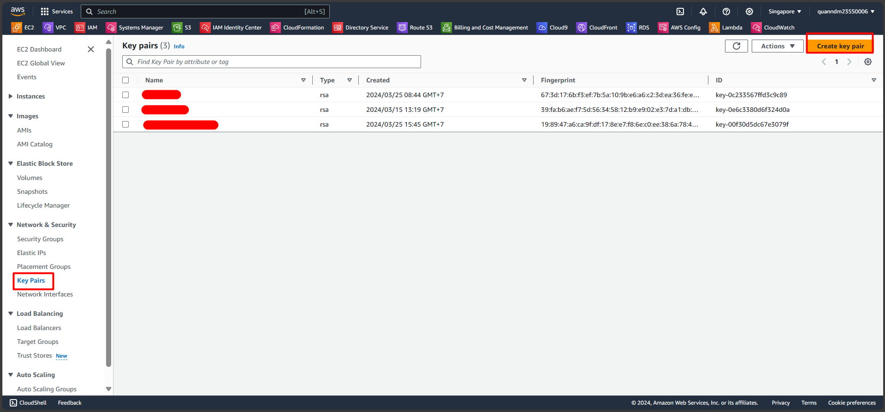
    
- Create key pair with options:
    - Name: my-project-kp
    - key pair type: RSA
    - file format: .pem
    - then click Create key pair
    
    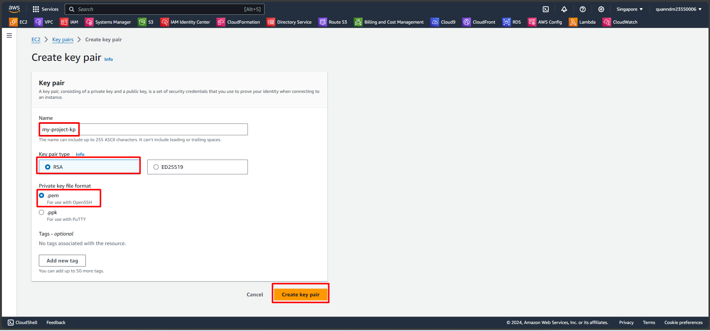
    
- Result
    
    
    
- save it into project (optional)
</details>

### Create VM(virtual machine)


- At folder VM, run command below to download package and init terraform project
    ```sh
    terraform init
    ```
- Run command to create EC2 instance and some depend resource
    ```sh
    terraform apply --auto-approve
    ```

- To remove all resource, run command
    ```sh
    terraform destroy --auto-approve
    ```

- To see output, run command
    ```sh
    terraform output
    ```
### Install and config jenkins server
- Read the file to setup Jenkin server in [jenkins-install-config.md](./installation/jenkins-install-config.md)

- config docker of jenkins server instance
  - modify file /lib/systemd/system/docker.service
      ```sh
      ExecStart=/usr/bin/dockerd -H unix://var/run/docker.sock -H tcp://172.31.24.237  --containerd=/run/containerd/containerd.sock
      ```
  - restart docker
      ```sh
      sudo systemctl daemon-reload
      sudo systemctl restart docker
      ```

### Run pipeline in jenkins server (dev environment)

- On Dashboard Jenkins, click new item on sidebar
    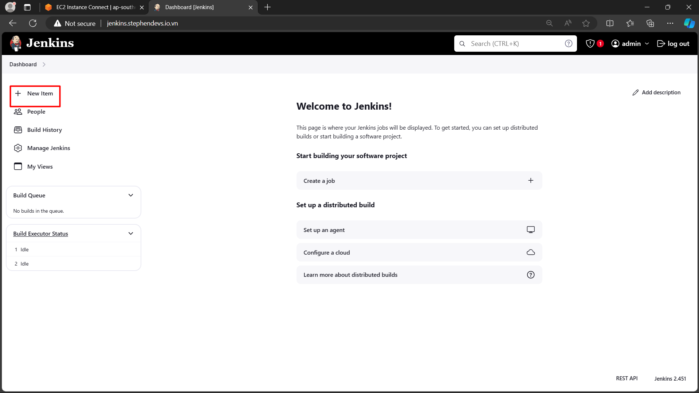
- Fill input, choose multiplebranch pipeline, then click OK
    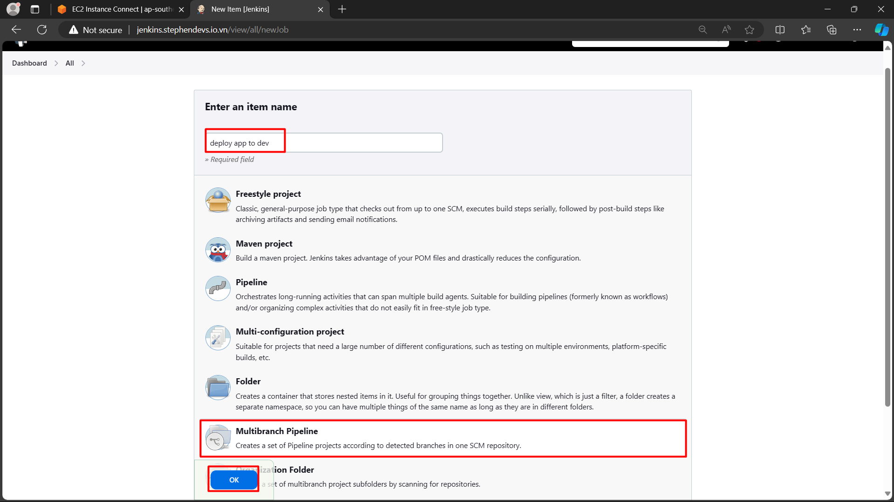
- branch source: choose git
    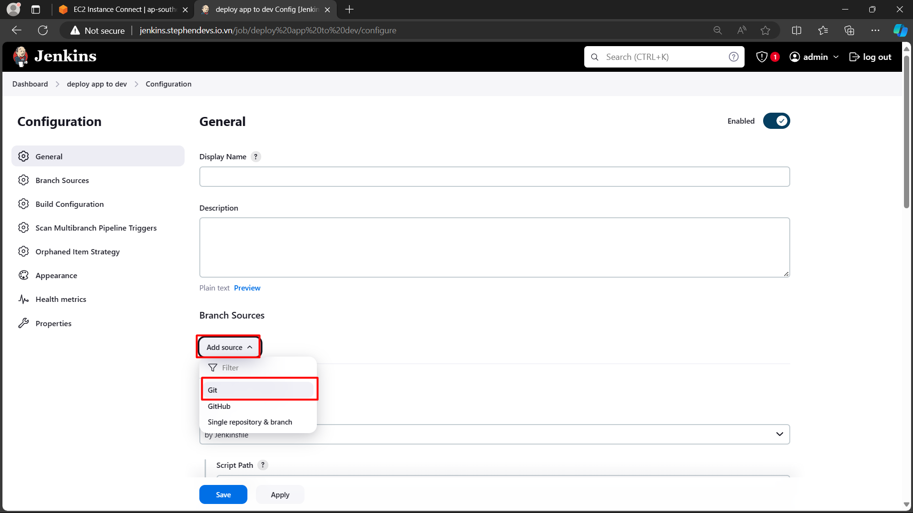
- Paste link repo of github, if it is private repo, must add credential
    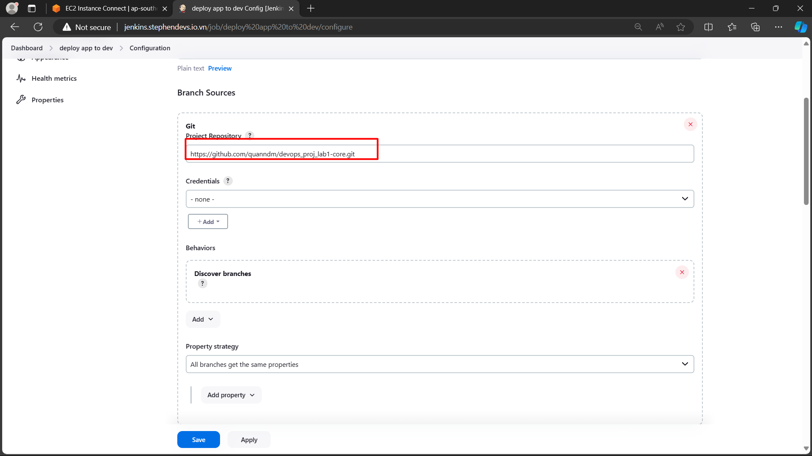
- Scan Multibranch Pipeline Triggers: choose Periodically if not otherwise run, interval: 1 minute
    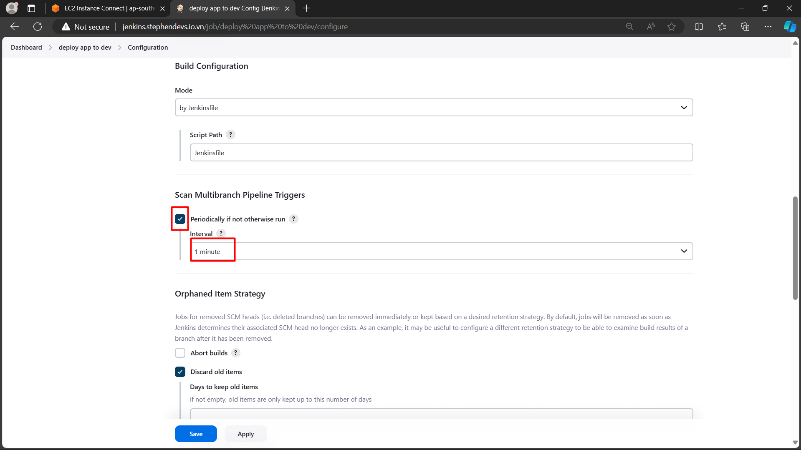
- Check again then click appy → save
    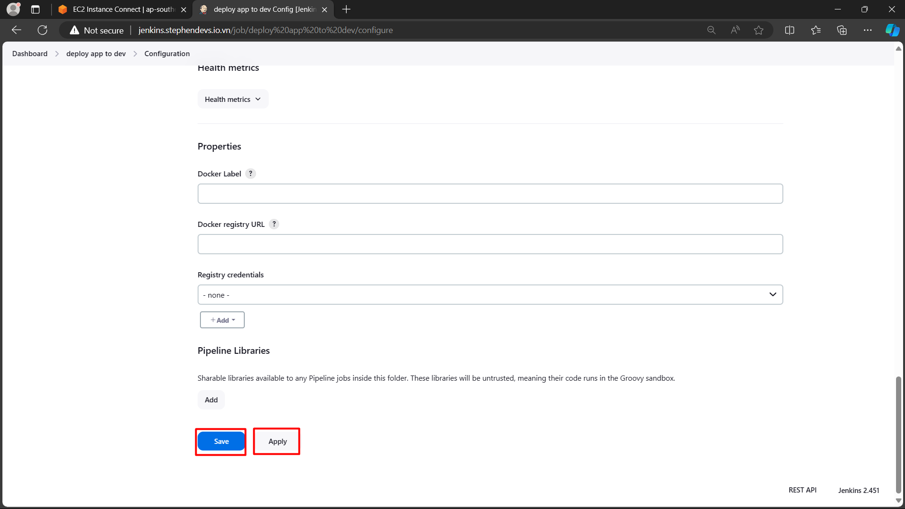
- return to pipeline, click blue ocean plugin on sidebar, then check result of pipeline
    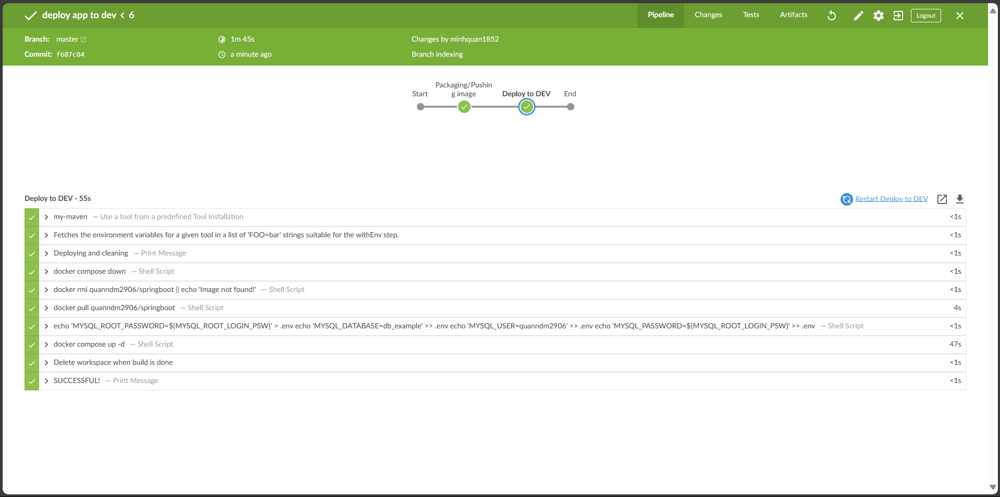
- test api
    - post method - create data
    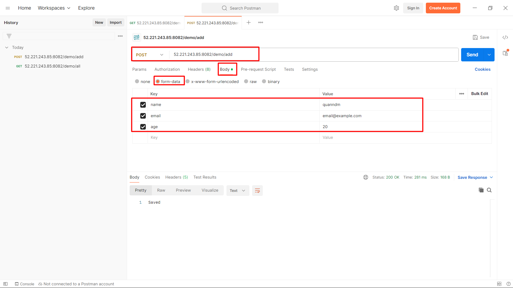
    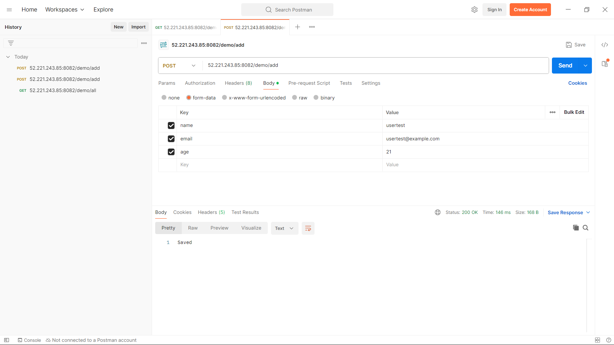
    - get method - show list data
    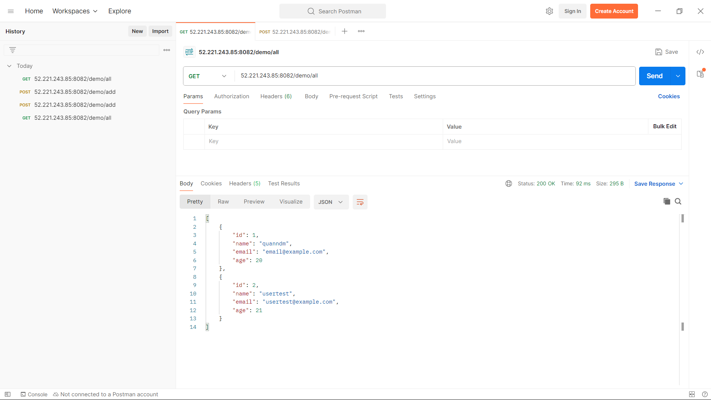

### Config and deploy project on QA and Staging envinronment
- Create a hosts file with content:
```
[host]
<DNS of QA server>   ansible_user=ubuntu
<DNS of Staging server>  ansible_user=ubuntu
```

- Create a script file to create user sql on first time
```
CREATE USER '<user name>'@'%' IDENTIFIED BY '<password>';
GRANT ALL PRIVILEGES ON db_example.* TO '<user name>'@'%';
FLUSH PRIVILEGES;
```

- Create a Dockerfile to build into ansible image
```
FROM ubuntu:22.04

ENV ANSIBLE_VERSION 2.17

RUN apt-get update; \
    apt-get install openssh-server openssh-client -y;\
    apt-get install -y gcc python3; \
    apt-get install -y python3-pip; \
    apt-get clean all

RUN pip3 install --upgrade pip; \
    pip3 install "ansible==${ANSIBLE_VERSION}"; \
    pip3 install ansible
```

- Create a playbook.yml file to define step to do to config on new environment
```
- name: ec2instance-playbook
  hosts: host
  become: yes
  become_user: root
  become_method: sudo
  tasks:
    - name: update
      apt:
        upgrade: yes
        update_cache: yes
        cache_valid_time: 86400

    - name: Install required system packages
      apt:
        pkg:
          - apt-transport-https
          - ca-certificates
          - curl
          - software-properties-common
          - python3-pip
          - virtualenv
          - python3-setuptools
        state: latest
        update_cache: true

    - name: Add Docker GPG apt Key
      apt_key:
        url: https://download.docker.com/linux/ubuntu/gpg
        state: present

    - name: Add Docker Repository
      apt_repository:
        repo: deb https://download.docker.com/linux/ubuntu focal stable
        state: present

    - name: Update apt and install docker-ce
      apt:
        name: docker-ce
        state: latest
        update_cache: true

    - name: Copy file with owner and permissions
      ansible.builtin.copy:
        src: ./script
        dest: /home/ubuntu/script
        owner: ubuntu
        group: ubuntu

    - name: Create a docker network
      docker_network:
        name: my-network
    - name: Re-create a MySQL container
      docker_container:
        name: quanndm2906-java-mysql
        image: mysql:8.0
        networks:
          - name: my-network
            aliases:
              - my-network
        env:
          MYSQL_ROOT_PASSWORD: 8NqUH_rNw58JLpqRp
          MYSQL_DATABASE: db_example
        detach: true
        state: started
        recreate: yes
        exposed_ports:
          - 3306
        pull: true
        comparisons:
          image: strict

    - name: SLEEP now !!!
      shell: sleep 15 && sudo docker exec -i quanndm2906-java-mysql mysql --user=root --password=8NqUH_rNw58JLpqRp < script

    - name: Re-create a Spring container
      docker_container:
        name: quanndm2906-springboot
        image: quanndm2906/springboot
        networks:
          - name: my-network
            aliases:
              - my-network
        state: started
        recreate: yes
        exposed_ports:
          - 8080
        detach: true
        published_ports:
          - 8080:8080
        pull: true
        comparisons:
          image: strict

    - name: Prune everything
      community.docker.docker_prune:
        containers: true
        images: true
```

- Create a jenkinsfile to run pipeline
```groovy
pipeline {

    agent any

    environment {
        ANSIBLE_HOST_KEY_CHECKING = 'False'
    }
    stages {
        stage("build image"){
            steps {
                sh "docker rmi my-jenkins-img || echo 'image not found!' "
                sh "docker build -t my-jenkins-img ."
            }
        }
        stage('Deploy container') {
           agent{
                docker {
                    image 'my-jenkins-img'
                }
            }
            steps {
                withCredentials([file(credentialsId: 'ansible_key', variable: 'ansible_key')]) {
                    sh 'ls -la'
                    sh "cp /$ansible_key ansible_key"
                    sh 'cat ansible_key'
                    sh 'ansible --version'
                    sh 'ls -la'
                    sh 'chmod 400 ansible_key '
                    sh 'ansible-playbook -i hosts --private-key ansible_key playbook.yml'
                }
            }
        }

        stage("clear image"){
            steps{
                sh "docker rmi my-jenkins-img || echo 'image not found'"       
            }
        }
        
    }
    post {
        // Clean after build
        always {
            cleanWs()
        }
    }
}
```

- create new credential using for ansible secret key
    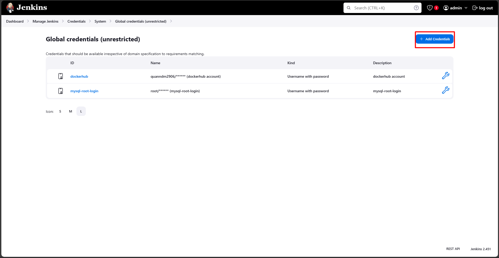
- Upload private key pair of EC2 instance
    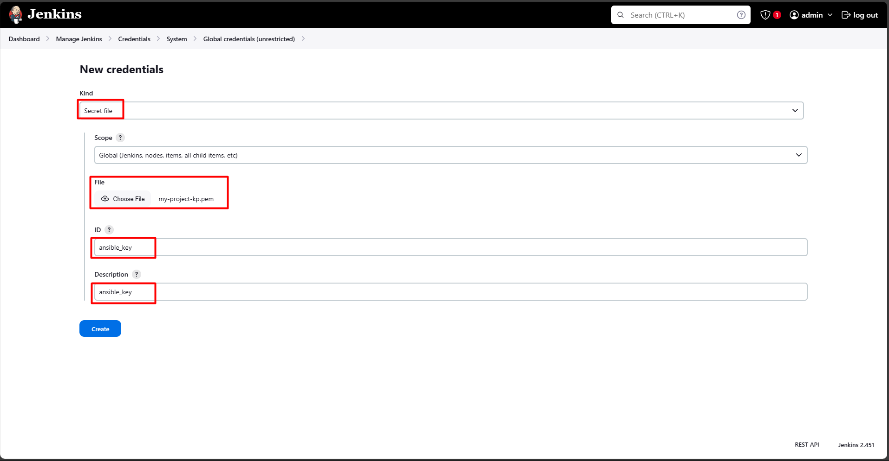
    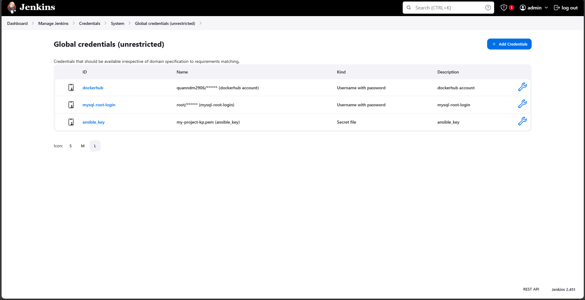
- Return to dashboard, click new item, choose multiplebranch pipeline
    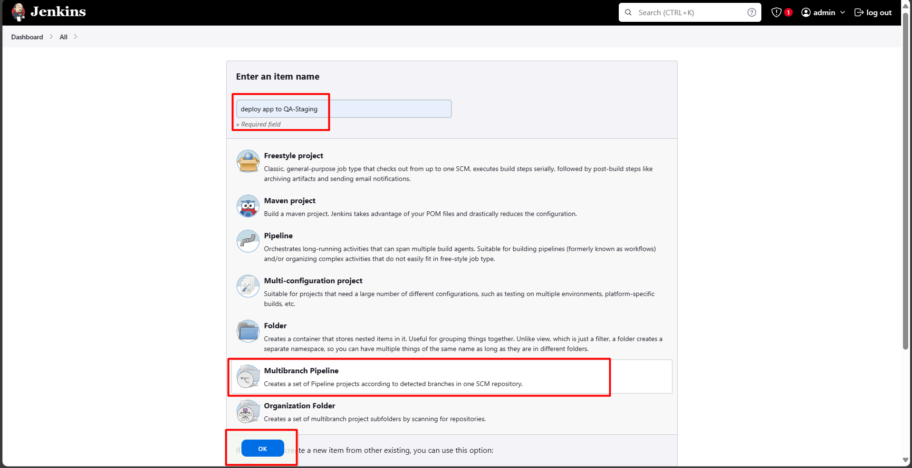
- choose git
    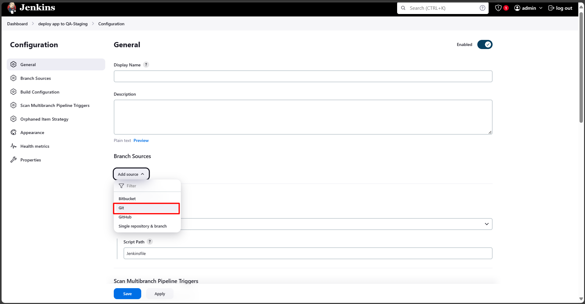
- Paste github link of project has pipeline run ansible
    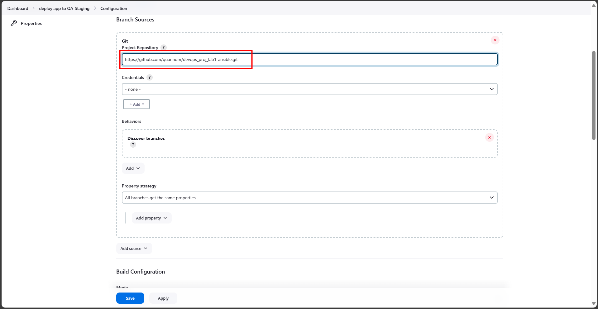
- Scan Multibranch Pipeline Triggers: 1 minute
    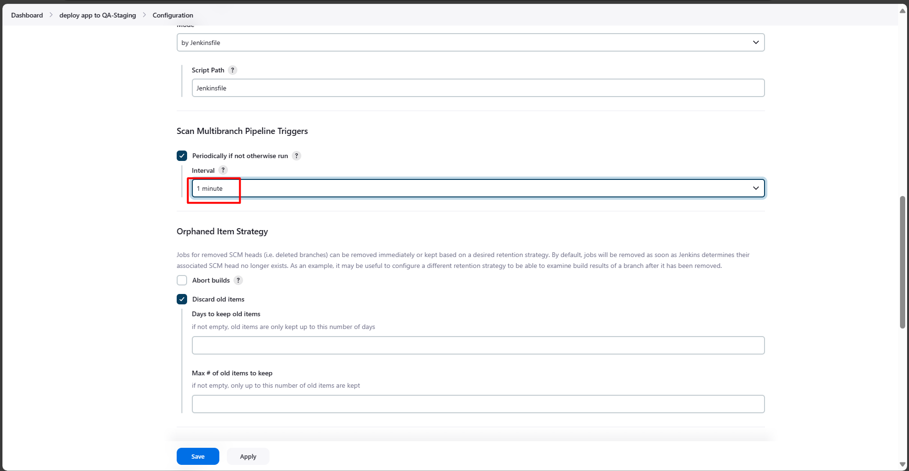
- click appy and save
    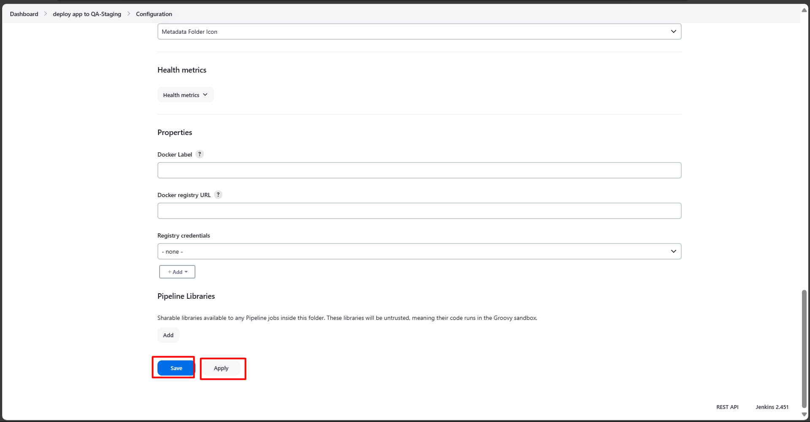
- return to blue ocean plugin to check status of pipeline
    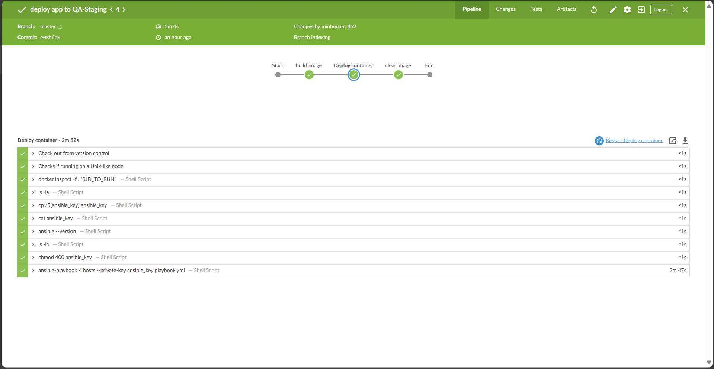
    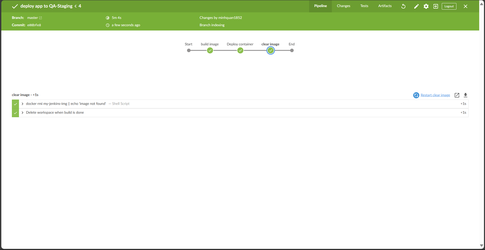
